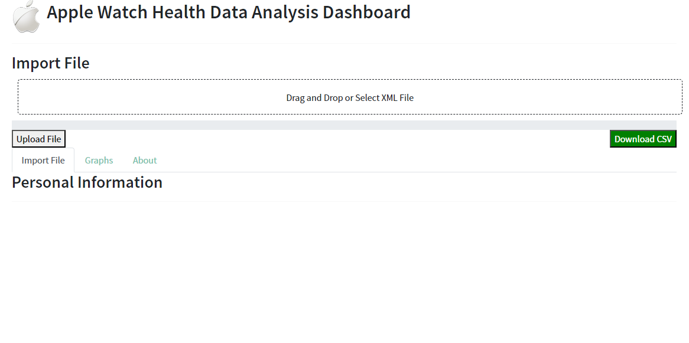
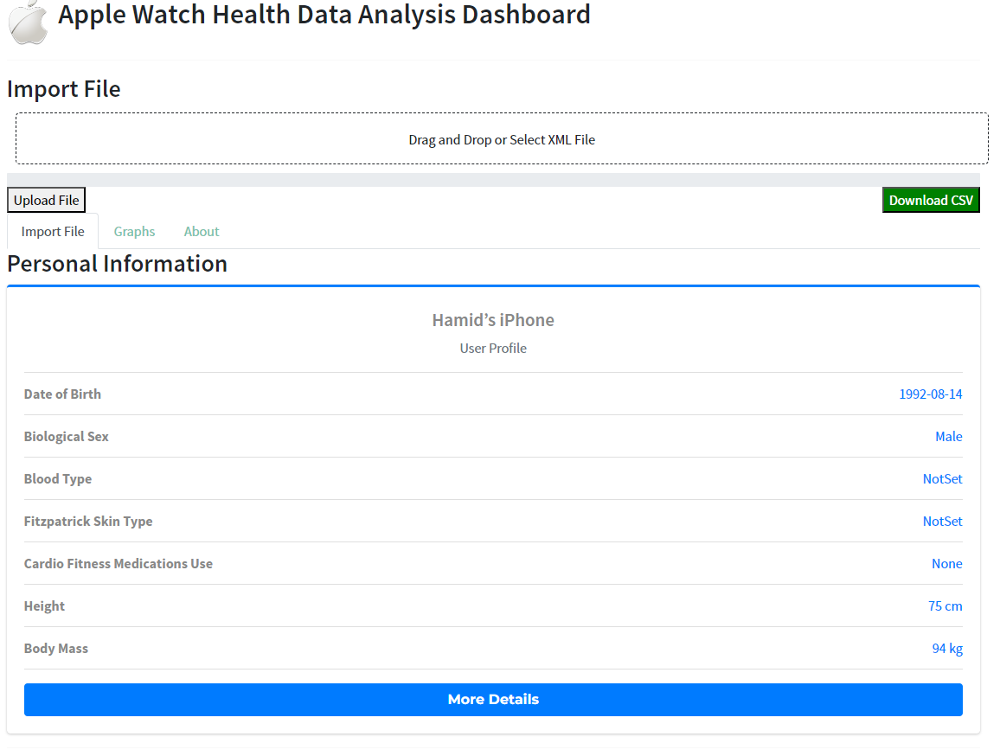

# Apple Watch Data Analysis Dashboard

This repository contains a Plotly Dash dashboard for analyzing Apple Watch data exported as XML files. The dashboard provides insights into personal information, heart rate, activity, and sleep patterns. Users can upload their XML files, visualize the data, and download the processed data as CSV.

## Features

- **Upload XML Files**: Upload your Apple Watch XML data file to start the analysis.
- **Personal Information**: View your personal information extracted from the XML file.
- **Heart Rate Analysis**: Visualize your heart rate data with various graphs.
- **Activity Analysis**: See detailed activity data including steps, calories burned, and more.
- **Sleep Analysis**: Analyze your sleep patterns with comprehensive graphs.
- **Download CSV**: Download the processed data as a CSV file for further analysis.
## Importance of XML to CSV Conversion

XML files are widely used for data storage and transfer due to their flexibility and ability to represent complex hierarchical data structures. However, for researchers and data analysts, working with XML files can be challenging due to their complexity and lack of compatibility with many data analysis tools. Converting XML to CSV makes the data more accessible and easier to manipulate with common data analysis software like Excel, R, and Python.

This app not only provides a comprehensive analysis of Apple Watch data but also serves as an XML to CSV converter, making it a valuable tool for researchers who need to transform their data into a more usable format for analysis.

## Installation

1. Clone the repository:
    ```sh
    git clone https://github.com/hamidsaeed13/Apple-Watch-Health-Data-Analysis-Dashboard.git
    ```
2. Navigate to the project directory:
    ```sh
    cd Apple-Watch-Health-Data-Analysis-Dashboard
    ```
3. Install the required packages:
    ```sh
    pip install -r requirements.txt
    ```
4. Run the dashboard:
    ```sh
    python app.py
    ```

## Usage

### Upload XML File



Navigate to the "Upload" tab to upload your Apple Watch XML file. Once uploaded, the progress bar will update and indicate the upload status.

### Personal Information



The "Personal Information" tab displays personal data extracted from the XML file, such as age, weight, height, etc.

### Heart Rate Analysis


The "Heart Rate" tab provides various graphs to visualize heart rate data over time.

### Activity Analysis


In the "Activity" tab, you can view detailed activity data including steps taken, calories burned, and more.

### Sleep Analysis


The "Sleep Analysis" tab shows your sleep patterns and provides comprehensive graphs for better understanding.

### Download CSV


Finally, the "Download CSV" tab allows you to download the processed data as a CSV file for further analysis.

## Contributing

Contributions are welcome! Please fork the repository and submit a pull request.

## License

This project is licensed under the MIT License. See the [LICENSE](LICENSE) file for details.
